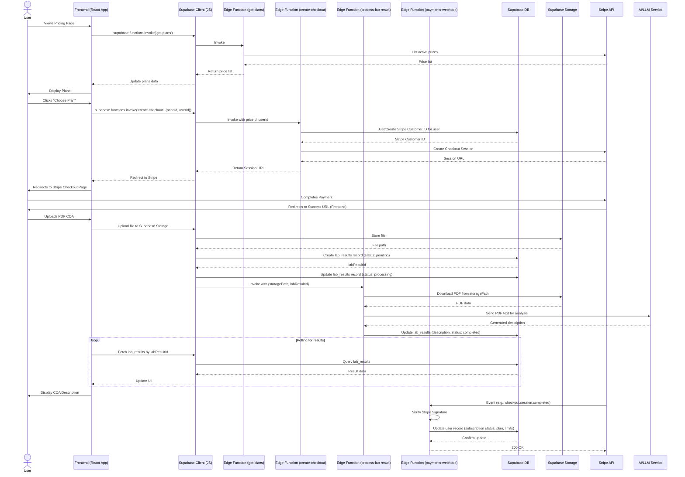

# System Interaction Flowcharts

This document contains flowcharts illustrating key interactions within the StrainInsights application, primarily between the frontend, Supabase Edge Functions, and external services.

## Main Interaction Flow (Sequence Diagram)

This diagram shows the sequence of events for major operations like fetching pricing plans, user checkout, lab result processing, and Stripe webhook handling.

This diagram provides a visual overview of the communication paths for the application's core functionalities. 