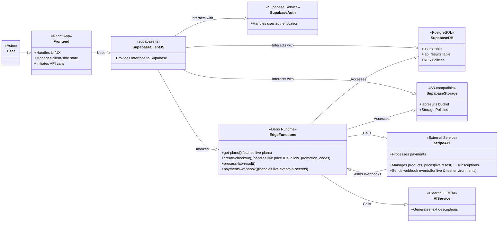
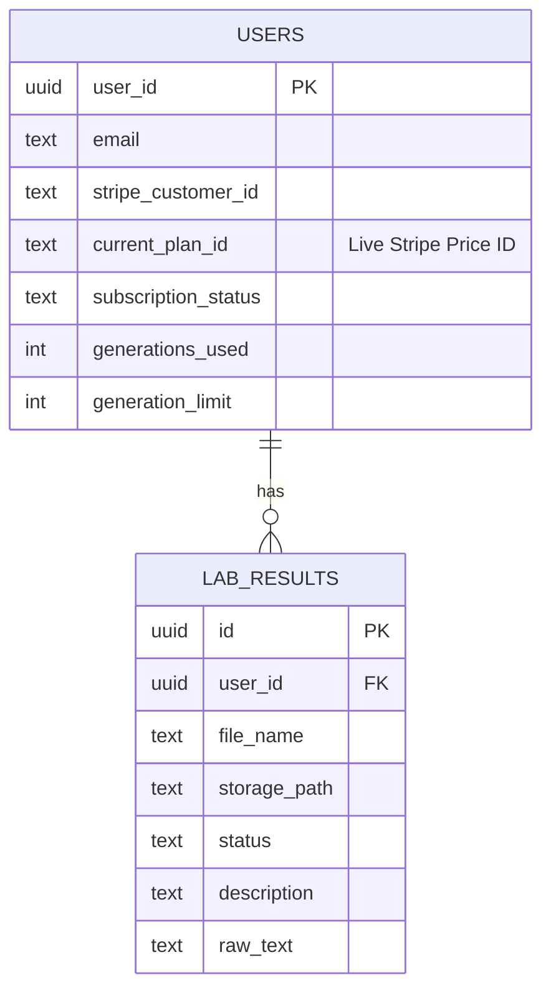

# System Architecture Mermaid Charts

This document contains Mermaid charts that visualize different aspects of the StrainInsights system architecture, focusing on component relationships and data structures.

## Component Relationship Diagram (Simplified)

This diagram shows the main components and their primary relationships.

## Database Schema (Simplified ERD-like view)

This diagram shows the key tables and their relationships in the Supabase database.

These charts offer a visual representation of the system's structure and data organization, complementing the textual documentation. 